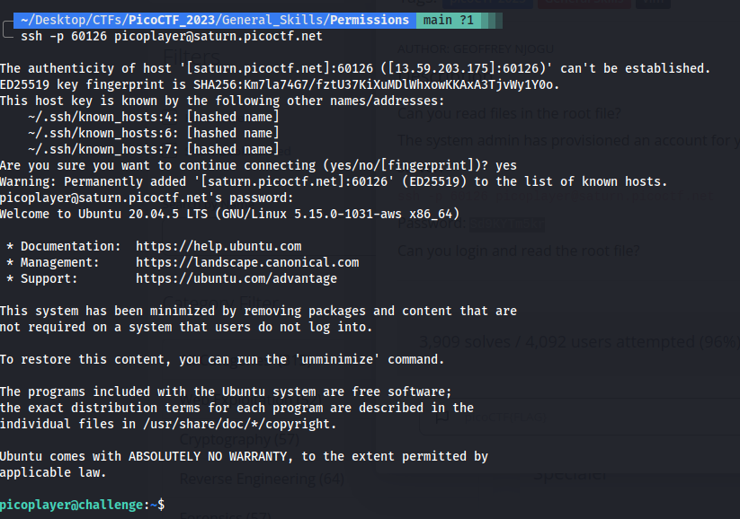

# Permissions
Can you read files in the root file?

So after we launch the instance we get a ssh credentials to connect to the machine where our flag is hidden.

So i connected to the machine using the command:-

`
ssh -p 60126 picoplayer@saturn.picoctf.net
`

After entering the machine using the given password we get this screen.

So this challenge was exactly solved like `chrono` I was really surprised to see that basically did it exactly like `chrono` only.

The flag is:- `picoCTF{uS1ng_v1m_3dit0r_89e9cf1a}`
