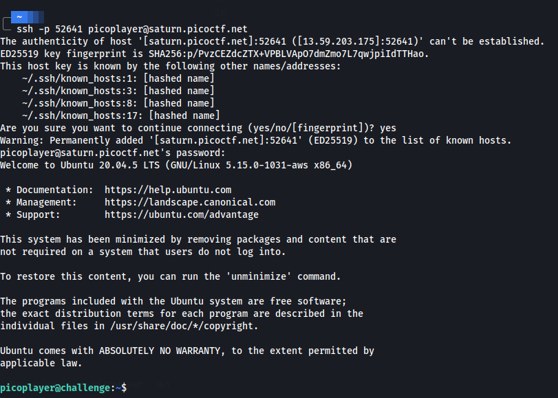
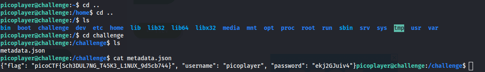

# Chrono
How to automate tasks to run at intervals on Linux servers?

So after we launch the instance we get a ssh credentials to connect to the machine where our flag is hidden.

I really don't know if this was the right way to solve this challenge or not but here is how i did it.

So i connected to the machine using the command:-

`
ssh -p 52641 picoplayer@saturn.picoctf.net
`

After entering the machine using the given password we get this screen.

Now what i did was go through the machine and found a challenge directory in the `/` directory which had a file called metadata.json which had the flag in it.

The flag is:- `picoCTF{Sch3DUL7NG_T45K3_L1NUX_9d5cb744}`
