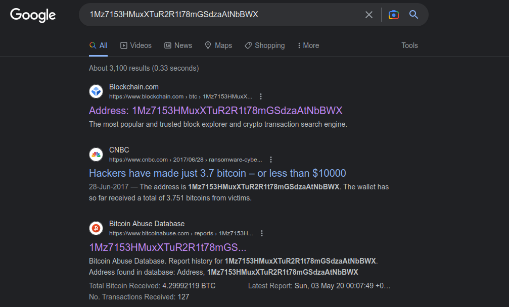
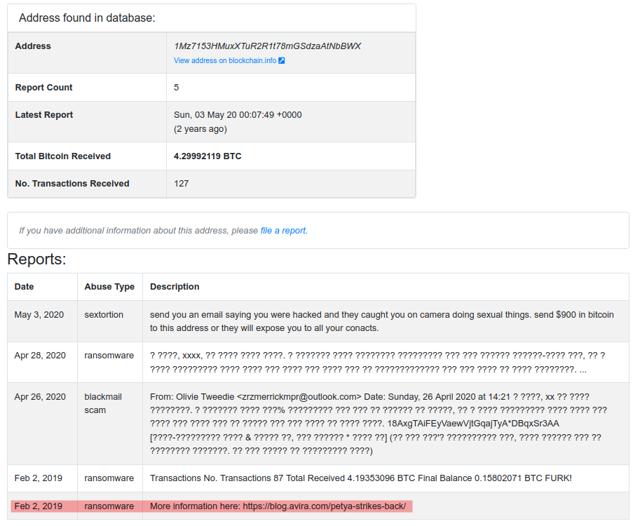

# money-ware

Flag format: picoCTF{Malwarename}

The first letter of the malware name should be capitalized and the rest lowercase.

Your friend just got hacked and has been asked to pay some bitcoins to 1Mz7153HMuxXTuR2R1t78mGSdzaAtNbBWX. He doesn’t seem to understand what is going on and asks you for advice. Can you identify what malware he’s being a victim of?

Hints given:-

  - Some crypto-currencies abuse databases exist; check them out!
  - Maybe Google might help.

So what I did first was I search up the bitcoin address up on google and got a very good site.

We can see that Bitcoin Abuse Database looks very interesting.

The highlighted part seems to be the name of the malware.

Thus the flag I went with was:- picoCTF{Petya} 
